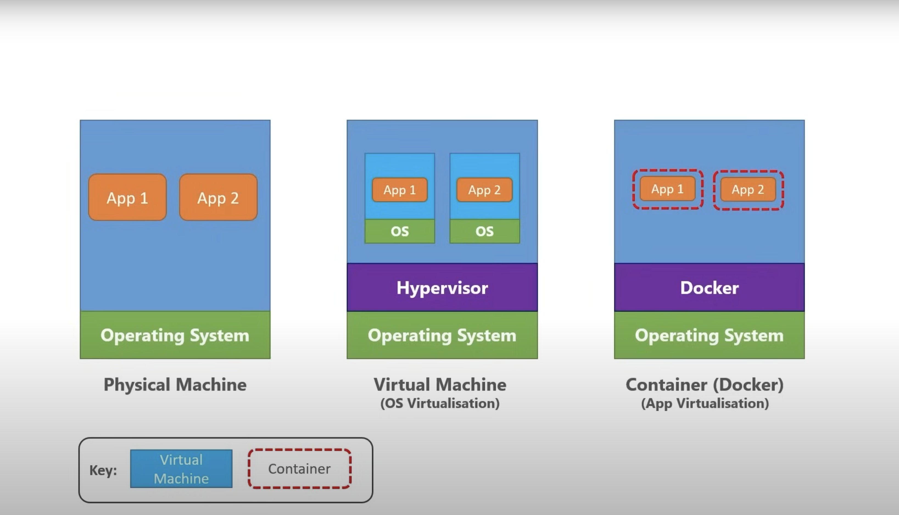

# Microservices-With-Kubernetes
Build micro services with Docker and orchestrates using Kubernetes(Rabbit MQ)

# Docker
Docker is a containerization platform, meaning that it enables you to package your applications into Images and run them as "Containers" on any platform that can run docker.

