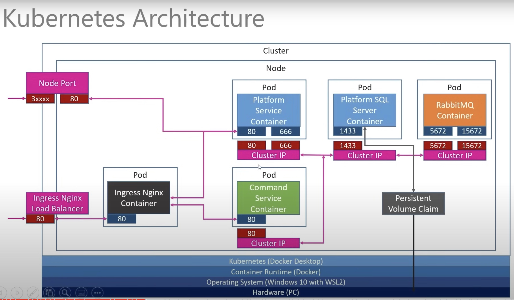
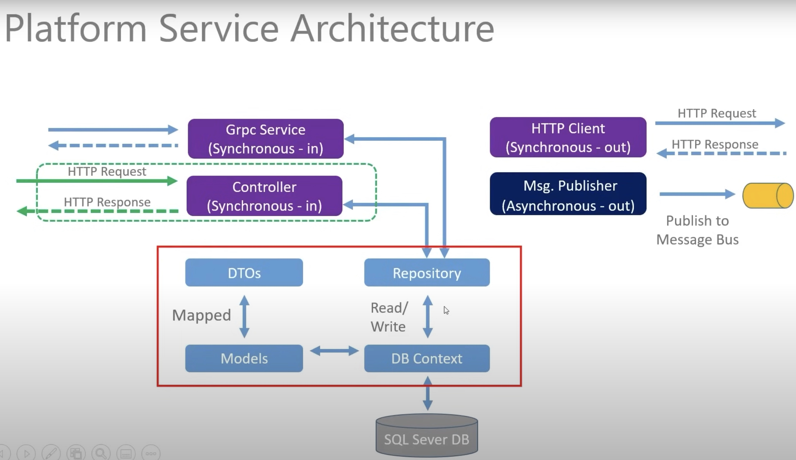

# Microservices-With-Kubernetes
Build micro services with Docker and orchestrates using Kubernetes(Rabbit MQ)

# Project architechture diagram with kubernetes

# Kubernetes
. Built by Google now maintained bt the Cloud Native Foundation
. Often referred to as "K8S"
. Container Orchestrator
. 2 broad user profiles
    . Developer
    . Administrator

# Docker
Docker is a containerization platform, meaning that it enables you to package your applications into Images and run them as "Containers" on any platform that can run docker.

# Platform service architechture diagram
