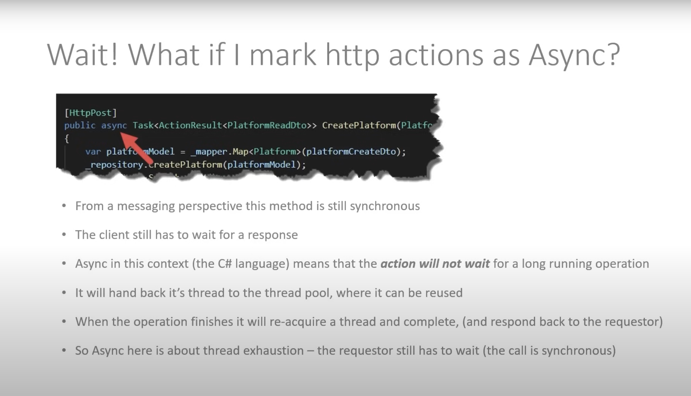
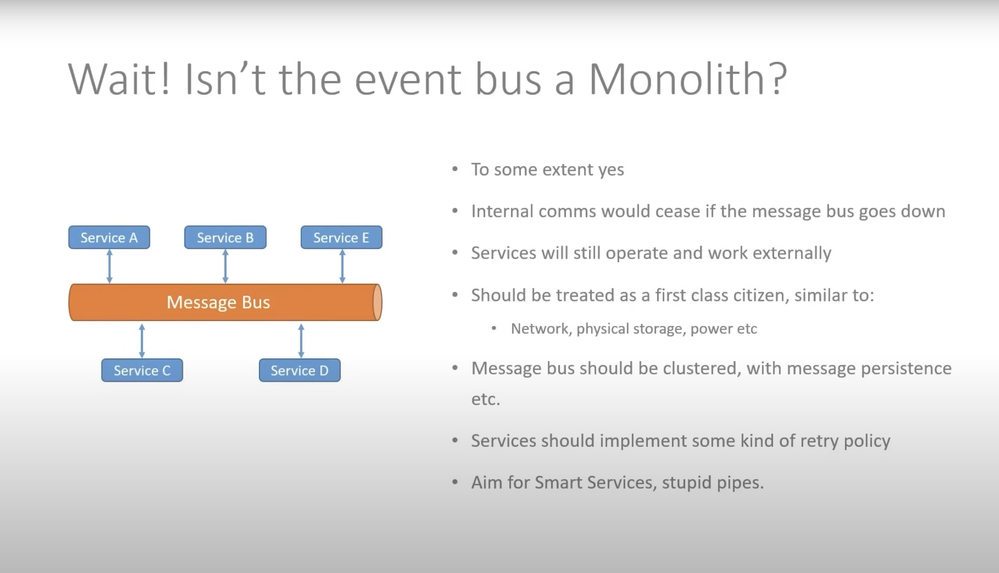

# Microservices-With-Kubernetes
**Build microservices with Docker and orchestrates using Kubernetes(Rabbit MQ)**

# Project architecture diagram with kubernetes

# Kubernetes
* Built by Google now maintained bt the Cloud Native Foundation
* Often referred to as "K8S"
* Container Orchestrator
* 2 broad user profiles
  1. Developer
  2. Administrator

# Docker

#### _Docker is a containerization platform, meaning that it enables you to package your applications into Images and run them as "Containers" on any platform that can run docker._

# Platform service architecture diagram

# Messaging 
### Synchronous & Asynchronous Messaging
 **Synchronous Messaging**
* Request/ Response cycle
* Requester will "wait" for response
* Externally facing services usually synchronous (like http requests)
* Services usually need to "know" about each other
* We are using 2 forms:
  * Http
  * Grpc

  
**Asynchronous Messaging**
* No request/response cycle
* Requester does not wait for response
* Event model, e.g publish - subscribe
* Typically used between services
* Event bus often used (we will use RabbitMQ)
* Services doesn't need to know about each other, just the bus
* Introduces its own range of complexities - not a magic bullet
